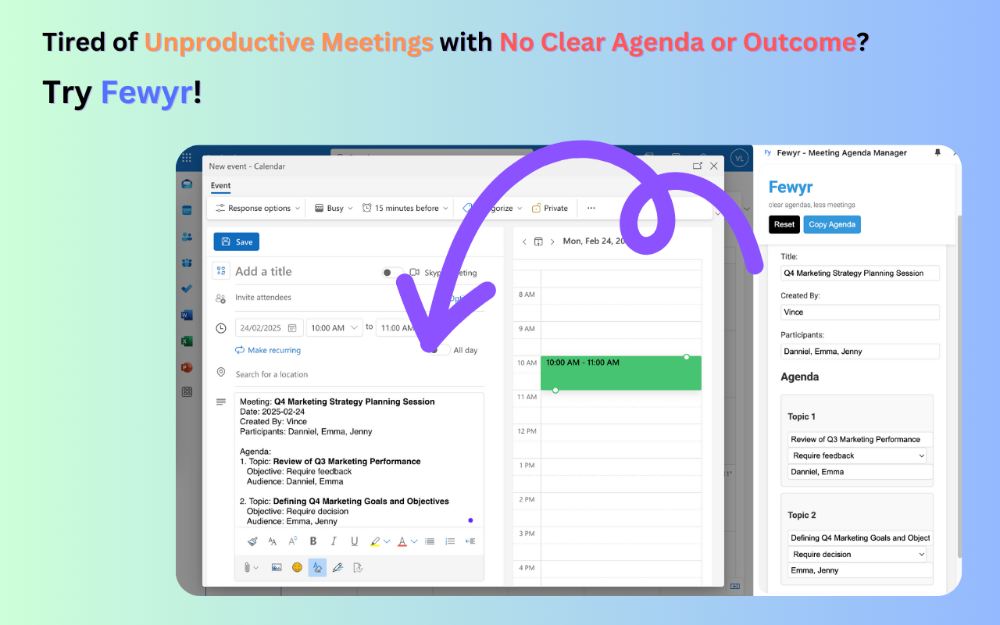

# Fewyr - Meeting Agenda Manager

Fewyr is a Chrome extension that helps you create clear, structured meeting agendas efficiently. It aims to reduce the number of meetings by making each one more focused and productive.

## Features

- Create structured meeting agendas with clear objectives
- Auto-populate participants based on agenda items
- Multiple objective types (FYI, Require feedback, Require action, etc.)
- Easy copy-to-clipboard functionality
- Responsive design that works in Chrome's side panel
- Local storage for meeting data persistence

## Installation

1. Download the extension from the Chrome Web Store (coming soon)
2. Click on the extension icon in your Chrome toolbar
3. The Fewyr side panel will open, ready for you to create meeting agendas

## Usage

1. Click the Fewyr icon in your Chrome toolbar to open the side panel
2. Fill in the meeting details:
   - Date
   - Title
   - Created By
3. Add agenda items:
   - Click "Add Agenda Item" to add new topics
   - Specify the topic, objective, and audience for each item
   - The participants list will auto-populate based on the audience field
4. Use the "Copy Agenda" button to copy the formatted agenda to your clipboard
5. Use the "Reset" button to clear all fields and start fresh

## Development

### Prerequisites

- Google Chrome browser
- Basic knowledge of HTML, CSS, and JavaScript
- Understanding of Chrome Extension development

### Local Development

1. Clone this repository
2. Open Chrome and navigate to `chrome://extensions/`
3. Enable "Developer mode" in the top right
4. Click "Load unpacked" and select the extension directory
5. The extension should now appear in your Chrome toolbar

## Contributing

Contributions are welcome! Please feel free to submit a Pull Request.

## License

This project is licensed under the MIT License - see the LICENSE file for details.
